# SLAM LAB1
This project develop the C++ ROS2 compatible turtle bot 3 SLAM. In this package contain the EKF(Extended Kalman's filter) and ICP(Iterative closet point) library. 

## EKF(Extended Kalman's filter) Explained

### State Explained
This EKF library use to predict 5 state of turtle bot

1. Robot x position in world frame ($x$)
2. Robot y position in world frame ($y$)
3. Robot velocity ($v$)
4. Z-axis Angle ($\theta$)
5. Z-axis Angular velocity ($\omega$)

### Model Explained
In the prediction process of the EKF, The robot model required for predicting the next move of the robot. The model I have chosen is the differential drive robot's kinematic model [1].

$$
\begin{align}
x_{k+1} &= x_k + d_k \cos \theta_k \tag{1} \\
y_{k+1} &= y_k + d_k \sin \theta_k \tag{2} \\
\theta_{k+1} &= \theta_k + \Delta \theta_k \tag{3} \\
d_k &= v_{t,k} \cdot T \tag{4} \\
\Delta \theta_k &= w_k \cdot T \tag{5} \\
v_{t,k} &= \frac{v_{l,k} + v_{r,k}}{2} = \frac{\omega_{l,k} \cdot R + \omega_{r,k} \cdot R}{2} \tag{6} \\
w_k &= \frac{v_{r,k} - v_{l,k}}{b} = \frac{\omega_{r,k} \cdot R - \omega_{l,k} \cdot R}{b} \tag{7}
\end{align}
$$

Where:
* **$x, y, \theta$**: Robot pose in the global coordinate frame.
* **$d_k$**: Incremental distance traveled.
* **$v_{t,k} / w_k$**: Linear and angular velocities of the robot base.
* **$v_l, v_r$**: Linear velocities of the left and right wheels.
* **$R$**: Wheel radius.
* **$b$**: Track width (distance between wheels).

Therefore, The differential drive robot's kinematic model [1] is non-linear model. In order to make it compatible with Kalman's equation, The model must linearization using the Jacobian matrix first. This is the F matrix, the Jacobian matrix of the model.

$$
F = \begin{bmatrix} 
1 & 0 & \cos(\theta) \Delta t & -v \sin(\theta) \Delta t & 0 \\
0 & 1 & \sin(\theta) \Delta t & v \cos(\theta) \Delta t & 0 \\
0 & 0 & 1 & 0 & 0 \\
0 & 0 & 0 & 1 & \Delta t \\
0 & 0 & 0 & 0 & 1 
\end{bmatrix}
$$

This matrix represents the partial derivatives of the state vector $[x, y, v, \theta, \omega]^T$ with respect to the previous state.
After linearization the model, This model be used in Kalman's equation.

### EKF equation
**Prediction Step**

$$
\begin{aligned}
\bar{\mu}_t &= f(\mu_{t-1}, u_t) \\
\bar{\Sigma}_t &= F_t \Sigma_{t-1} F_t^T + Q_t
\end{aligned}
$$

**Correction Step**

$$
\begin{aligned}
K_t &= \bar{\Sigma}_t H_t^T (H_t \bar{\Sigma}_t H_t^T + R_t)^{-1} \\
\mu_t &= \bar{\mu}_t + K_t(y_t - h(\bar{\mu}_t)) \\
\Sigma_t &= (I - K_t H_t) \bar{\Sigma}_t
\end{aligned}
$$

Where:
* $\mu_t$ (State Estimate): The mean of the state vector (e.g., position and heading) at time $t$.
* $\Sigma_t$ (State Covariance): A matrix representing the estimated uncertainty of the current state.
* $F_t$ (State Transition Jacobian): The linearized matrix of the motion model used to project the state forward.
* $Q_t$ (Process Noise Covariance): Represents the uncertainty or noise in the robot's physical movement model.
* $K_t$ (Kalman Gain): A weighting factor that balances trust between the prediction and the sensor measurement.
* $H_t$ (Measurement Jacobian): A matrix that maps the predicted state space into the sensor observation space.
* $y_t$ (Sensor Measurement): The actual observation data received from sensors (e.g., IMU, encoders).
* $R_t$ (Measurement Noise Covariance): Represents the expected noise or error characteristics of the physical sensors.

> Note: This EKF library can use both with 3 measurement (pure EKF) ($v$, $\theta$, $\omega$) and with 5 measurement(EKF+ICP) ($x, y, v, \theta, \omega$)

## ICP(Iterative closest point) library Explained
The 2D Lidar is wildly using for SLAM. The problems of the 2D Lidar is "If we know our position and the laser scan. How do we know that the point we acquire is correct and How do we acquire the position from Lidar". The ICP is the method of matching the map(in this case is previous scan) with the new laser scan and find the R(rotation) and T(Translation) of the robot that make new laser scan match the map the most.

### Process of ICP
1. **Initial guess**: Used the first odometry and first scan to predict the first move and the starter map.
2. **Correspondence Finding**: For each point in the new scan (transformed by the current pose estimate), the algorithm finds the closest point in the global map using a spatial hash table (a 2D grid structure for fast nearest-neighbor lookups).
3. **Transform Computation**: Given the matched point pairs, it calculates the optimal rotation and translation using SVD (Singular Value Decomposition):
4. **Iteration**: Applies the computed correction to the pose estimate and repeats. Stops when the change between iterations is tiny (converged) or after 25 iterations.

### Outliers rejection
The Lidar scan may found the noise and outliers. To prevent the error occurs from noise and outliers. The median-based outliers protection used for delete the outliers that more than the $2.5 \times$ the square root of median error in each correspondence.

### Hallway aliasing protection
The 2D Lidar feature of data is only the range from robot to the object. If the hallway lookalike, it may cause the ICP to return the same position overtime. To protecting the hallway aliasing, The motion model is used to recheck the position after the ICP. If the wall may look a like but robot impossible to move, Then the ICP will reject the result.

## Integration Explained

 * The `wheel_odom` represent the $x,y,\theta$ of the robot using only wheel odometry.

 * The `ekf_odom` represent the $x,y,\theta$ of the robot using EKF with measurement of wheel encoder and IMU.

 * The `ICP_odom` represent the $x,y,\theta$ of the ICP by using the `ekf_odom` as an initial guess, Then feed $x, y$ as a measurement of the `icp_ekf`

## Result
The ROS2 bag provided by TA. and Prof. is FIBO's floor 3 with difference setting. 

### 1. Sequence 00 – Empty Hallway
A static indoor hallway environment with minimal obstacles and no dynamic objects. This sequence is intended to evaluate baseline odometry and sensor fusion performance.

#### Localization
Image of seq.0 path in Rviz |  Image of seq.0 path plot
:-------------------------:|:-------------------------:
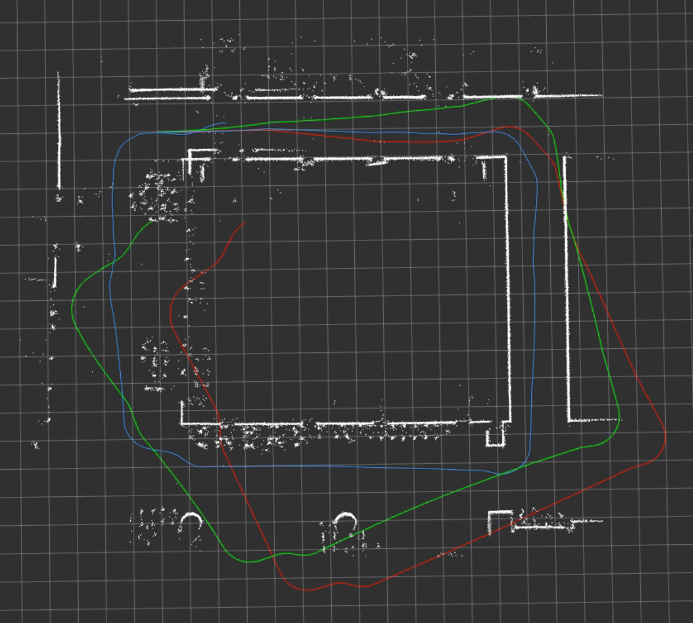  |  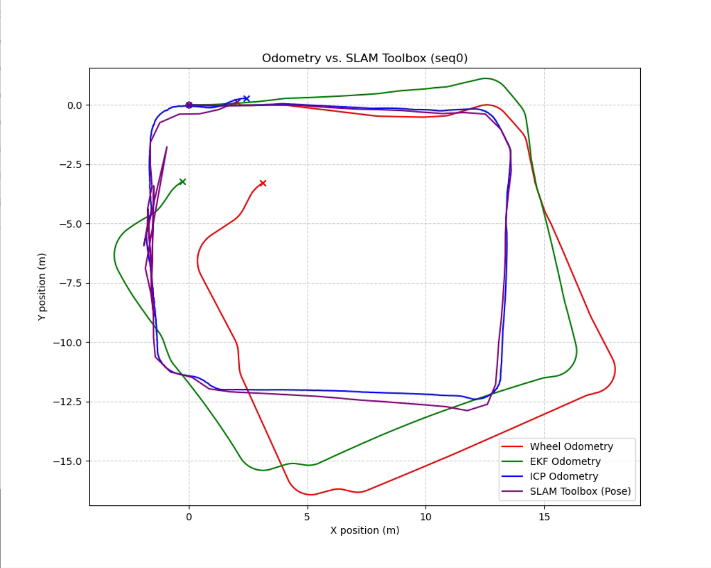

The Wheel Odometry and EKF show the both drift in orientation. But EKF show the less drift in orientation than wheel odometer. The ICP help correct the rotational drift due to the wheel slip and the IMU drift.

#### Mapping

Image of seq.0 map by ICP  |  Image of seq.0 map by SLAM toolbox
:-------------------------:|:-------------------------:
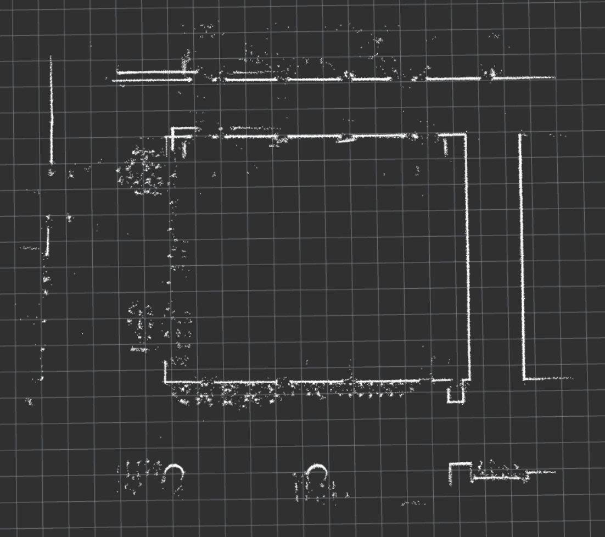  |  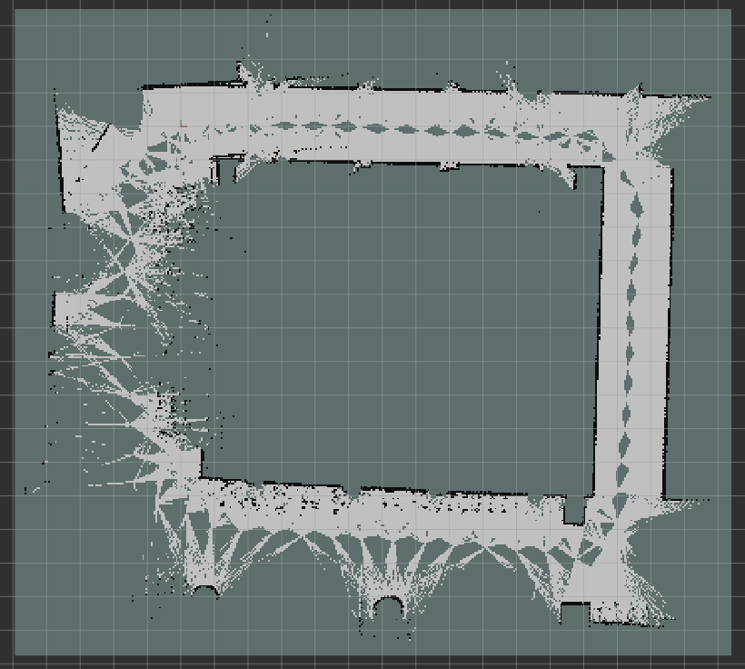

The map from ICP and SLAM toolbox look similar and can recognize as a FIBO's floor 3. The map build by the ICP may drift after run back to the start due to the drift in position

### 2. Sequence 01 Non-Empty Hallway with Sharp Turns:
An indoor hallway environment containing obstacles and clutter, with sections of sharp turning motion. This sequence is designed to challenge odometry and scan matching performance under rapid heading changes.

#### Localization

Image of seq.1 path in Rviz |  Image of seq.1 path plot
:-------------------------:|:-------------------------:
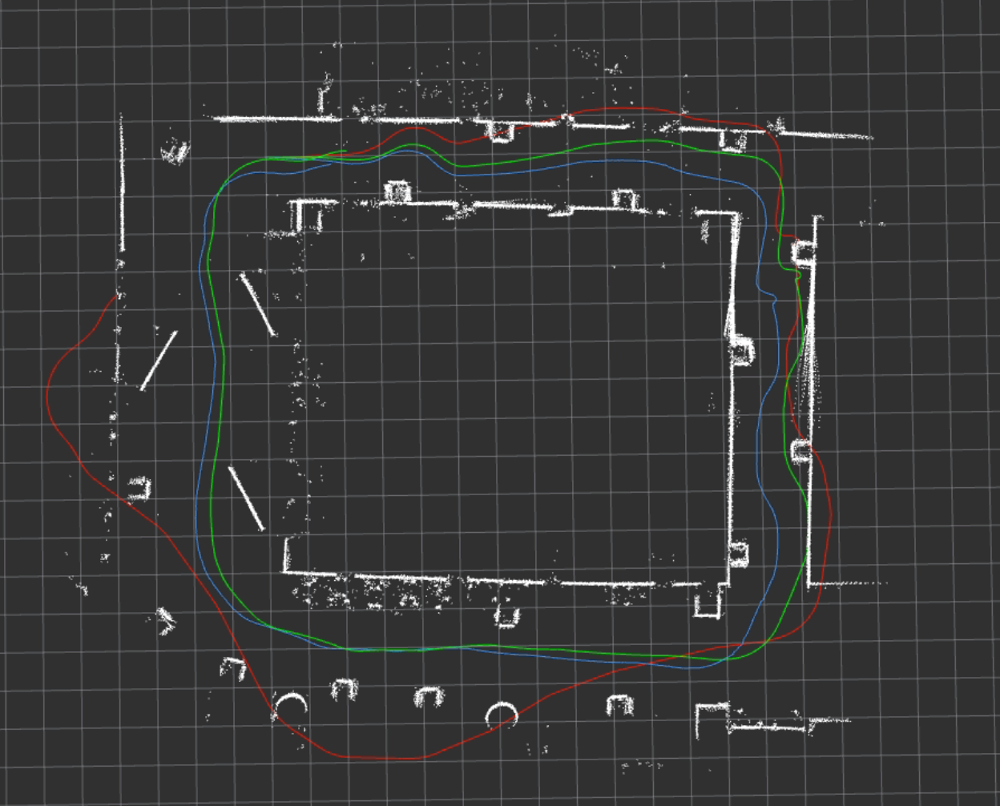  |  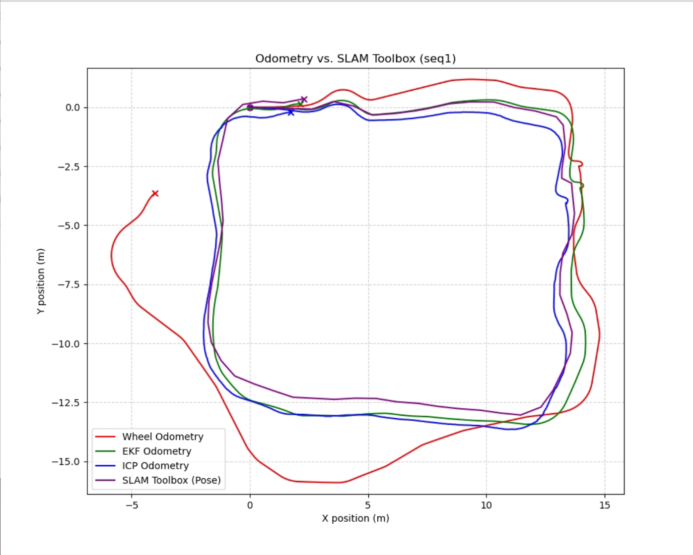

Seq.1 contain the sharp turn and obstacle. The sharp turn creates the drift in wheel odometry. In other hand, The IMU have more accuracy in sharp turn because of no wheel slip effect the orientation. With the obstacle, The ICP show the potential more than the empty hallway. The feature of the data in seq.1 make the better reference point to ICP and cause the localization more precise

#### Mapping

Image of seq.1 map by ICP  |  Image of seq.1 map by SLAM toolbox
:-------------------------:|:-------------------------:
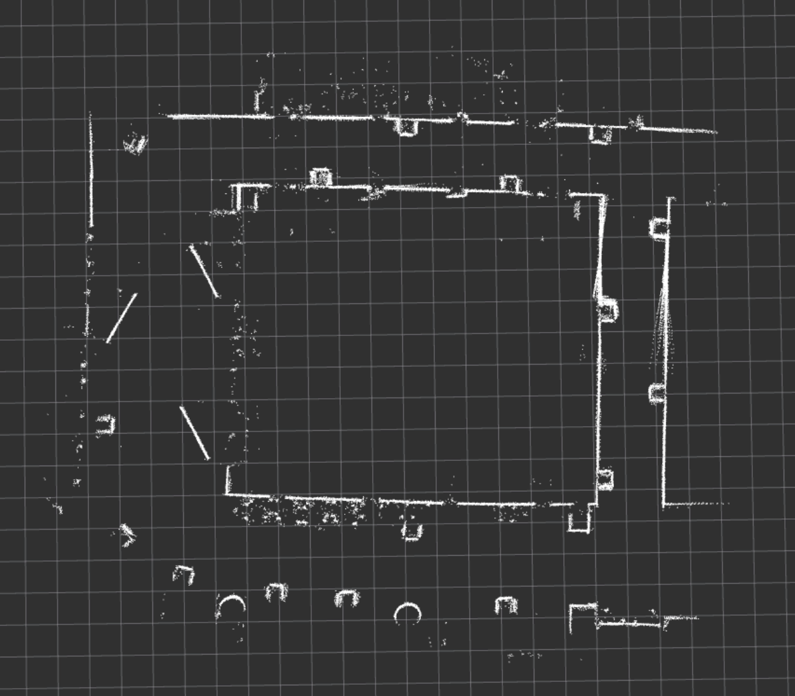  |  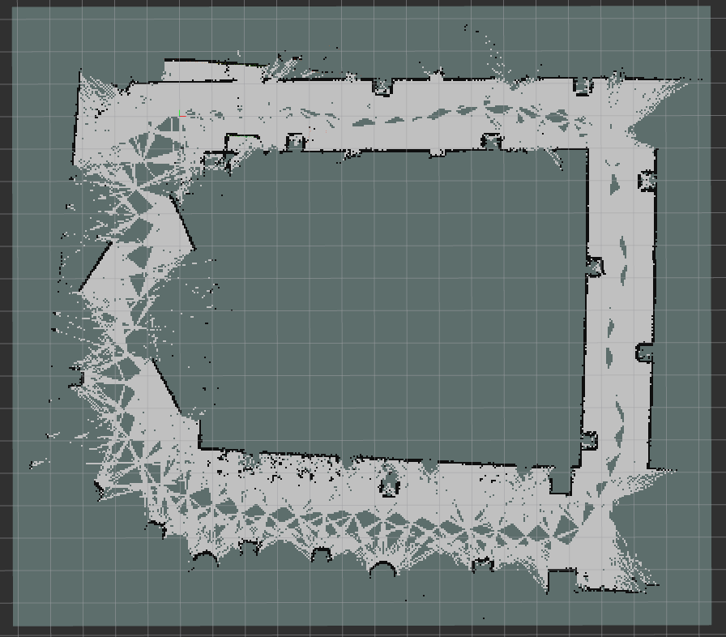

As mention in the localization part of seq.1, The obstacle create the feature for ICP make the Hallway Aliasing problems occur less than in the empty hallway. But with the sharp turns, The ICP show the small mapping error due to the sharp turn in the second hallway.

### 3. Sequence 02 – Non-Empty Hallway with Non-Aggressive Motion: 
An indoor hallway environment with obstacles, similar to Sequence 2, but recorded with smoother and non-aggressive robot motion. This sequence is intended to evaluate performance under more stable motion conditions.

#### Localization

Image of seq.2 path in Rviz |  Image of seq.2 path plot
:-------------------------:|:-------------------------:
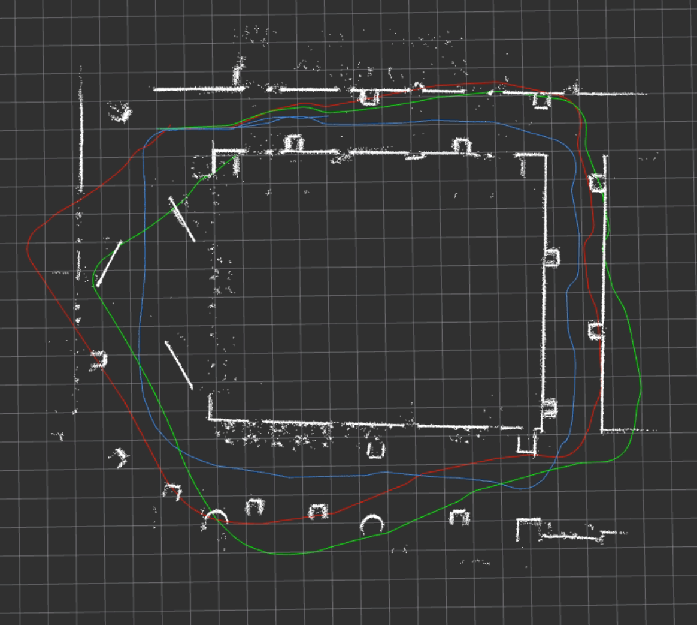  |  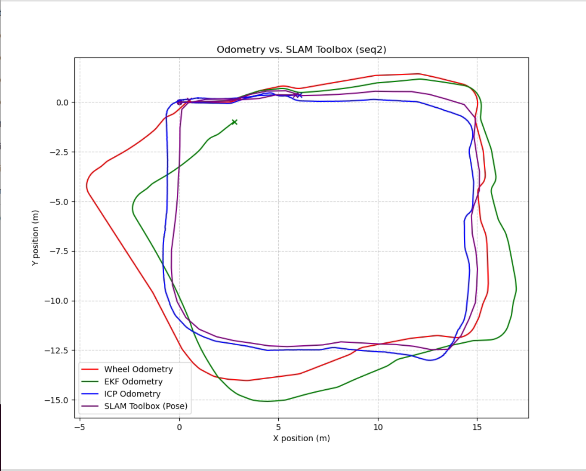

With obstacle, The ICP can localization correctly due to the feature of the data created by the obstacle. With less sharp turn the IMU drifted overtime make the EKF drift more than seq.1.

#### Mapping

Image of seq.2 map by ICP  |  Image of seq.2 map by SLAM toolbox
:-------------------------:|:-------------------------:
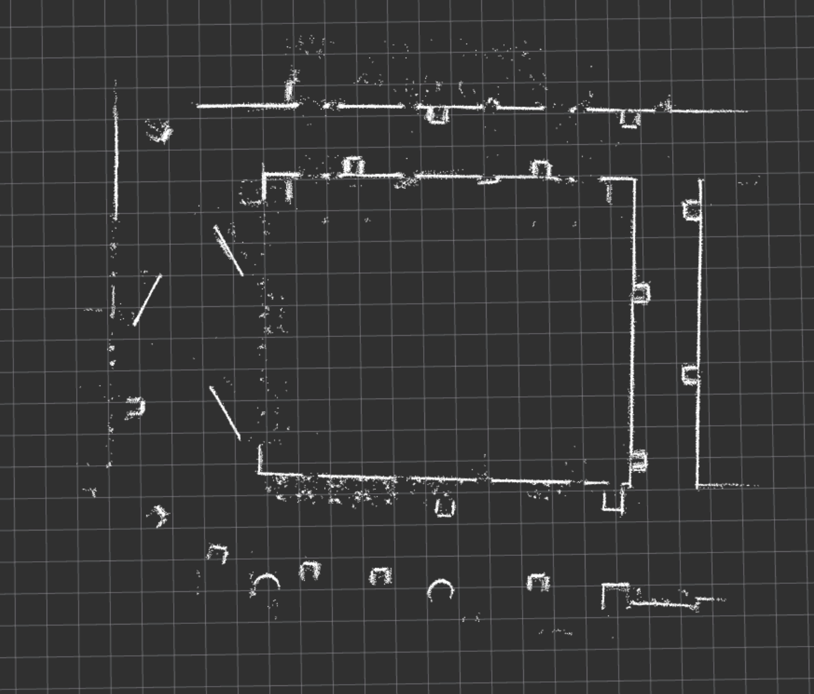  |  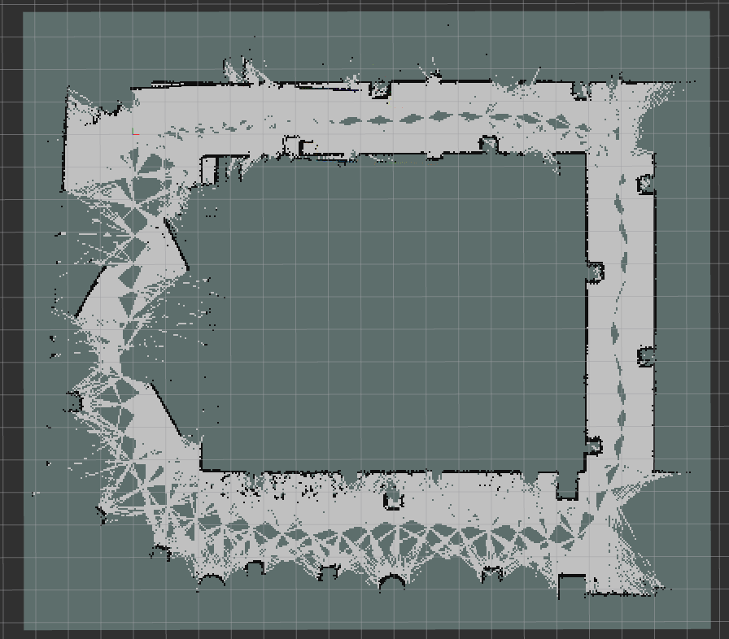

As mention in the localization part of seq.2, The obstacle create the feature for ICP make the Hallway Aliasing problems occur less than in the empty hallway. But with no sharp turn the map from seq.2 is more precise.

## Conclusion
Wheel odometry shows massive drift due to wheel slip and the lack of a ground truth sensor. An EKF uses IMU fusion with a kinematics model, which creates an accuracy difference compared to wheel odometry. Because the IMU is integrated, the change in angle can be used to correct the orientation of the robot. With the Kalman model, the noise from the sensor and the model can be integrated together, making the data more reliable; however, it still drifts due to measurement errors and the lack of a ground truth sensor.

The best methodology is to use an EKF with ICP. With ICP, Lidar data can be used to correct the translation and rotation of the robot. EKF-only odometry relies on three measurements (v,θ,ω), but with ICP, the EKF can rely on five measurements (x,y,v,θ,ω), making ICP more reliable than EKF-only odometry.

The problem with ICP is empty hallway aliasing. With identical walls, ICP can recognize a new wall as the same wall and predict that the robot has not moved. Because of this, walls with obstacles help ICP perform localization and mapping more correctly. This makes ICP with EKF odometry the most trustworthy data compared to wheel odometry and EKF-only odometry.

## Reference
[1] Ahmed, S., & Al-Mulla, M. A. (2022). "Extended Kalman Filter Sensor Fusion in Practice." *International Journal of Advanced Computer Science and Applications (IJACSA)*, 13(2). [Link to Paper](https://thesai.org/Downloads/Volume13No2/Paper_4-Extended_Kalman_Filter_Sensor_Fusion_in_Practice.pdf)

